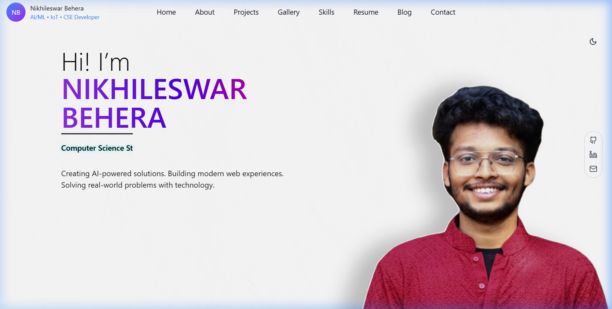
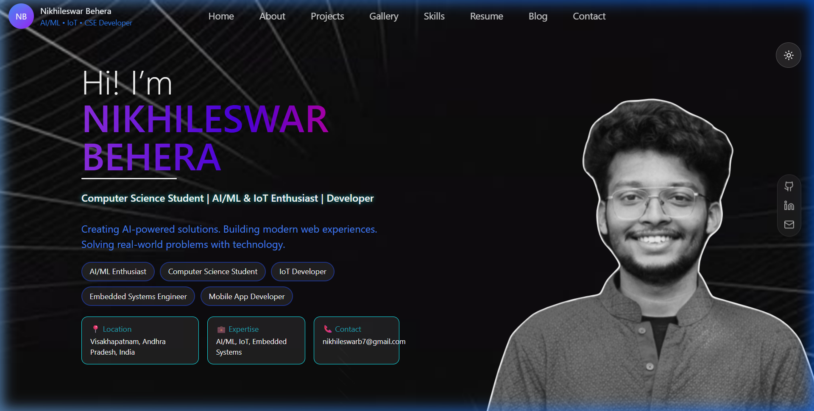
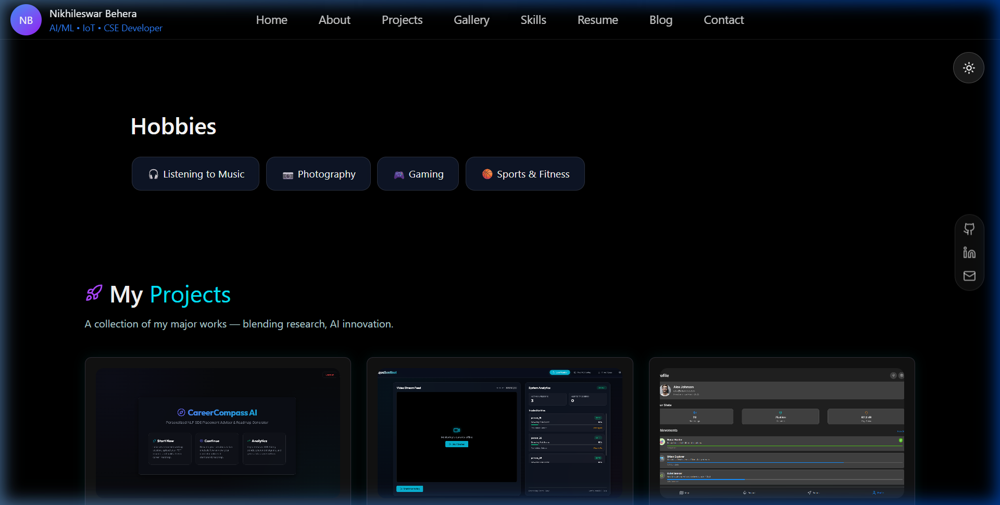
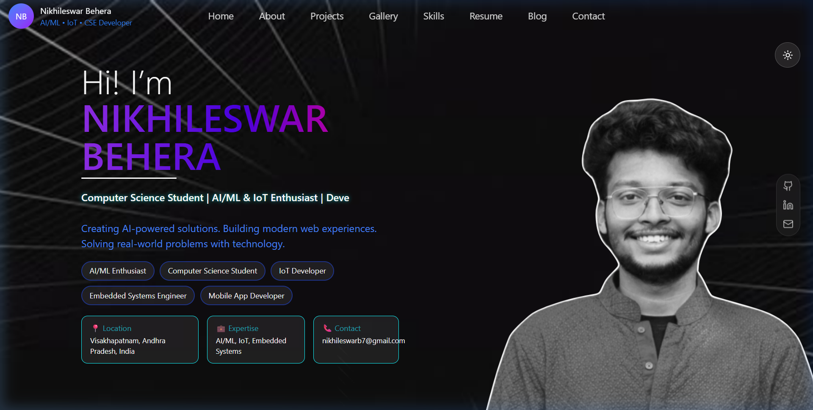

# 👨‍💻 Nikhileswar Behera — AI/ML, IoT & Software Developer

Welcome to my personal portfolio repository! I am a Computer Science student passionate about building AI-powered systems, modern web experiences, and smart IoT/embedded hardware solutions. 

This repository host the source code for my interactive portfolio, designed with clean aesthetics, glassmorphic styling, and dynamic cursor tracking.

---

## 🖼️ Portfolio Previews

### 🌌 Interactive Homepage (Dark & Light Mode with Cursor spotlights)

### 🚀 Projects Grid (Cursor spotlight glow & hover effects)

### 📸 Dynamic Gallery (Achievements, Camera & Mobile Shots)

---

## 🌟 Key Features of My Portfolio

* 🎨 **Glowing & Glassmorphic UI/UX**: Custom styling with interactive radial gradients that track cursor coordinates across card containers.
* ⚡ **Fluid Motion**: Powered by **Framer Motion** for smooth entrances, hover scaling, and transition animations.
* 🌓 **Real-time Theme Toggling**: Fluidly switches variables between dark mode (neon cyan/purple highlights) and light mode (neon blue/pink highlights).
* 🖥️ **High-Performance Spotlight**: Custom-designed background spotlight that tracks mouse coordinates with direct DOM inline styling (bypassing React re-renders for a smooth 60fps+ experience).
* 💼 **Responsive Layouts**: Crafted using flex grids and word-wrapping boundaries to render beautifully on mobile devices, tablets, and wide screens.

---

## 🛠️ Core Expertise & Skills

* **Artificial Intelligence & Machine Learning**: Computer Vision, Motion Analysis, Sound Classification, Recommendation Engines.
* **IoT & Embedded Systems**: Sensor Automation, Smart City Systems, Smart Waste/Water Management.
* **Software Development**: React.js, TypeScript, Flutter, Python, C/C++, Java, PostgreSQL.

---

## 🚀 Featured Projects

* **CareerCompass AI**: AI-driven career guidance platform with PostgreSQL analytics mapping skill gaps and custom career roadmaps.
* **AquaSentinel**: Edge-AI computer vision drowning prevention system with real-time alerting achieving 94% accuracy.
* **Nexotrack**: Flutter/Firebase app classifying environmental noise levels with GPS heatmaps.
* **Swachh Netra**: Smart IoT-enabled sensor automation system improving waste management collection efficiency.

---

## 📬 Let's Connect!

I am always open to collaborating on innovative software/hardware projects or discussing technology. Feel free to reach out through any of the channels below:

* 📧 **Email:** [nikhileswarb7@gmail.com](mailto:nikhileswarb7@gmail.com)
* 💼 **LinkedIn:** [linkedin.com/in/nikhileswar-behera](https://www.linkedin.com/in/nikhileswar-behera)
* 🐙 **GitHub:** [github.com/nikhileswarb7-dotcom](https://github.com/nikhileswarb7-dotcom)
* 💬 **WhatsApp:** [+91 7684023522](https://wa.me/917684023522)

---

### 🏁 License

This project is open-source and available under the [MIT License](LICENSE).
